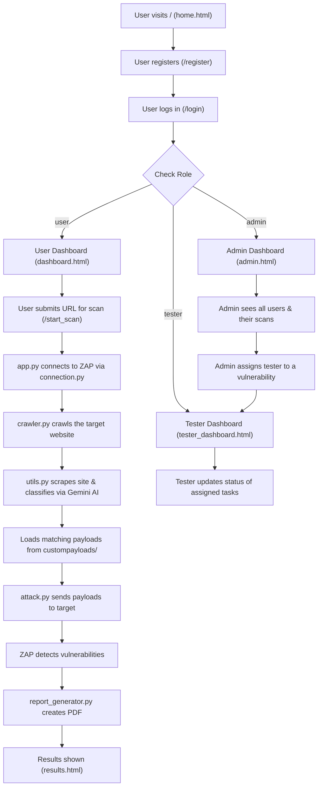

# PayloadWeaver (Web-Fuzzer) — Complete Project Explanation

## What is this Project?

**PayloadWeaver** is a **web vulnerability scanner** built with Python Flask. It uses **OWASP ZAP** (Zed Attack Proxy) as its scanning engine to crawl websites and test them for security vulnerabilities like XSS, SQL Injection, and Command Injection.

It has a role-based system with **3 user roles**: User, Tester, and Admin. The idea is:
1. A **User** submits a target URL for scanning.
2. The app connects to ZAP, crawls the website, and attacks it with payloads.
3. A **PDF report** of vulnerabilities is generated.
4. An **Admin** reviews scan results and assigns a **Tester** to fix each vulnerability.
5. The **Tester** updates the status (under review → in progress → completed).

---

## How the Application Works (Flow)



---

## File-by-File Explanation & Connections

### 🟢 Core Application Files (KEEP)

| File | Purpose | Connected To |
|------|---------|-------------|
| [app.py](file:///C:/Users/Arsalan%20Sharief/Desktop/New%20folder%20(3)/Web-fuzzer/app.py) | **Main Flask app** — the entry point. Defines all routes, database models (User, ScannedURL, Tester), authentication, scanning logic, and renders templates. This is what `supervisord.conf` runs. | `crawler.py`, `attack.py`, `report_generator.py`, `connection.py`, all templates, `instance/site.db` |
| [connection.py](file:///C:/Users/Arsalan%20Sharief/Desktop/New%20folder%20(3)/Web-fuzzer/connection.py) | Connects to the OWASP ZAP proxy using `zapv2` library. Returns a `zap` object used by crawler and attack modules. | Used by `app.py`, `main.py` |
| [crawler.py](file:///C:/Users/Arsalan%20Sharief/Desktop/New%20folder%20(3)/Web-fuzzer/crawler.py) | Uses ZAP's spider to **crawl** the target website and discover all URLs/pages. Returns the list of crawled URLs. | Used by `app.py`, `main.py` |
| [attack.py](file:///C:/Users/Arsalan%20Sharief/Desktop/New%20folder%20(3)/Web-fuzzer/attack.py) | **Sends attack payloads** to the target URL. Uses multi-threading for speed. Loads payloads from `custompayloads/` via `utils.py`. Collects ZAP alerts as vulnerabilities. | Uses `utils.py`. Used by `app.py`, `main.py` |
| [utils.py](file:///C:/Users/Arsalan%20Sharief/Desktop/New%20folder%20(3)/Web-fuzzer/utils.py) | **AI-powered payload selection**. Scrapes the target website, sends content to **Google Gemini AI** to classify the site type (e-commerce, blog, portfolio, etc.), then returns the path to the matching payload folder. | Used by `attack.py` |
| [report_generator.py](file:///C:/Users/Arsalan%20Sharief/Desktop/New%20folder%20(3)/Web-fuzzer/report_generator.py) | Generates **PDF reports** using `reportlab`. Has two functions: `generate_report()` for single-URL scans and `generate_combined_report()` for multi-URL scans. | Used by `app.py`, `main.py` |
| [requirements.txt](file:///C:/Users/Arsalan%20Sharief/Desktop/New%20folder%20(3)/Web-fuzzer/requirements.txt) | Lists all Python dependencies | Used for `pip install` |
| [dockerfile](file:///C:/Users/Arsalan%20Sharief/Desktop/New%20folder%20(3)/Web-fuzzer/dockerfile) | Docker config to run ZAP + Flask together in a container | Uses `supervisord.conf`, `requirements.txt` |
| [supervisord.conf](file:///C:/Users/Arsalan%20Sharief/Desktop/New%20folder%20(3)/Web-fuzzer/supervisord.conf) | Process manager config — runs ZAP daemon and `app.py` simultaneously inside Docker | Used by `dockerfile` |

---

### 🟢 Template Files (in `templates/`) — KEEP

| Template | Used By | Purpose |
|----------|---------|---------|
| `home.html` | `app.py` route `/` | Landing page with background video |
| `index.html` | `app.py` route `/home` | Secondary home/index page |
| `login.html` | `app.py` route `/login` | Login form |
| `register.html` | `app.py` route `/register` | User registration form |
| `registeradmin.html` | `app.py` route `/registeradmin` | Admin/tester registration (role selectable) |
| `dashboard.html` | `app.py` — user role | User dashboard — shows scan history |
| `admin.html` | `app.py` — admin role | Admin dashboard — lists all users |
| `tester_dashboard.html` | `app.py` — tester role | Tester dashboard — shows assigned tasks |
| `user_vulnerabilities.html` | `app.py` route `/user/<id>` | Admin view of a user's scan results + assign tester |
| `results.html` | `app.py` after scan completes | Scan results page with vulnerability details |

---

### 🟢 Key Directories — KEEP

| Directory | Purpose |
|-----------|---------|
| `custompayloads/custompayloads/` | Contains **9 subdirectories** (blogs, corporate, ecommerce, educational, entertainment, government, portfolio, social_media, test_dummy) each with a `payload.txt`. The AI classifies the target site and picks the matching payload set. |
| `static/` | Static assets (images, videos, fonts, generated PDF reports) |
| `static/reports/` | Where `generate_report()` saves single-URL scan PDFs |
| `instance/` | Contains `site.db` — the SQLite database |
| `migrations/` | Flask-Migrate / Alembic DB migration files |
| `templates/fonts/` | Font files used by templates |

---


## Architecture Diagram

```mermaid
graph LR
    subgraph Docker Container
        ZAP["OWASP ZAP<br/>(port 8080)"]
        Flask["Flask App<br/>(port 5000)"]
        Supervisor["supervisord"]
        Supervisor --> ZAP
        Supervisor --> Flask
    end

---